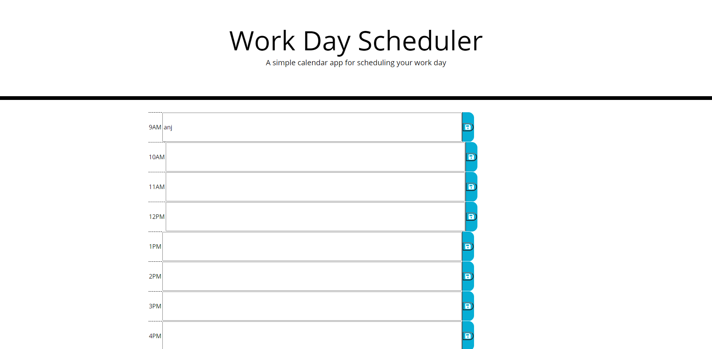

# Workday Scheduler


The website application was created by manipulating the CSS styling and HTML provided by Trilogy Education Services. The application allows the user to plan their work day and save their activities to their local storage by using the corresponding save buttons. The table structure of the HTML was created using JavaScript DOM manipulation. Through the use of **localStorage.getItem()** and **localStorage.setItem()** I was able to store the users initial input in the local storage when the button is clicked. 
Furthermore I learnt how to access the current time, as shown in the code quoted below: 
```
//setting colors
    var d = new Date();
    var currentHour= console.log(d.getHours());
    
```
This was learnt from [W3Schools.com](https://www.w3schools.com/JSREF/jsref_gethours.asp). I enjoyed completing the backend JavaScript necessary to store the data. It was a long nit picking process but I am very proud of the final result shown below.



The functioning website can be found at [Work Day Scheduler](https://anjkrish2608.github.io/workdayScheduler/Develop/index.html).
## Challenges faced

Throughout the creation of this website I faced many challenges. The biggest and still present challenge I faced was the linking to and ensuring functioning of the premade CSS. The error occured when I introduced the ``` <form> ``` tag into the HTML which was necessary to ensure the function of the input field. Due to time management this was unable to be fixed. The CSS of the final result still needs some work and this is an area I am keen to improve on.

## Credits

Throughout creating this website to ensure correct syntax and resolve any errors [W3Schools.com](https://www.w3schools.com/) was consulted.

© 2019 Trilogy Education Services, a 2U, Inc. brand. All Rights Reserved.